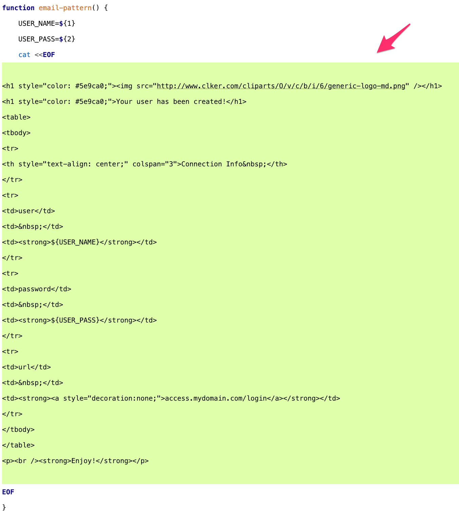

# Bash Email Sender Tutorial

````
./bash-email-sender-tutorial.sh angel@gmail.com
````

### 1 - sendEmail

#### 1.1 - using sendEmail


#### 1.2 - install sendEmail

[Installation tutorial](https://brewinstall.org/Install-sendemail-on-Mac-with-Brew/)

or

```` bash
brew install sendemail
````


### 2 - Create a google app password

[https://security.google.com/settings/security/apppasswords](https://security.google.com/settings/security/apppasswords)

#### 2.1 - Create new app password


#### 2.2 - Insert custom name


#### 2.3 - Copy password


#### 2.4 - Created app password


### 3 - Automate your process and send an email

#### 3.1 - How to use
[bash-email-sender-tutorial.sh](bash-email-sender-tutorial.sh)

##### 3.1.1 - Edit username resolver


##### 3.1.2 - Edit Process


##### 3.1.3 - Edit HTML


##### 3.1.4 - Put your credentials


#### 3.2 - Run your script

##### 3.2.1 - Bash process OK


##### 3.2.2 - Bash process NOK


#### 3.3 - Email


